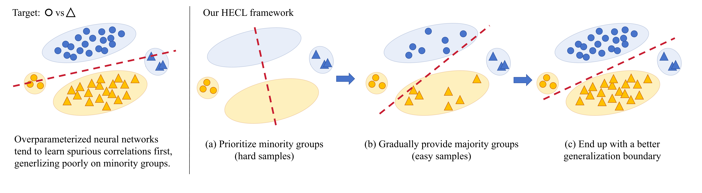

# Play Hardball: Hard-to-Easy Curriculum Learning for Mitigating Spurious Correlations


<div align="center">
  
</div><br/>

## Abstract

Deep models can heavily rely on spurious correlations (e.g., background features), compromising generalization under subpopulation shifts. In
this work, we identify a pervasive yet underexplored phenomenon: existing mitigation methods typically achieve peak performance on minority groups during the earliest stages of training
(e.g., the first epoch for GroupDRO), followed
by a significant degradation. We hypothesize that
this stems from the intrinsic difficulty of minority groups in classification; not only are they numerically underrepresented, but they also require
the model to learn more complex, invariant features rather than largely relying on simple spurious correlations. Further experiments reveal
that: (1) early exposure to spurious correlations
leads to irreversible bias; (2) reversing the traditional curriculum order by starting with hard (minority) samples improves group generalization.
Based on these findings, we propose a Hard-toEasy Curriculum Learning (HECL) framework
for spurious correlation mitigation. Contrary to
the conventional Easy-to-Hard paradigm, we invert the learning order by prioritizing hard (minority) samples and progressively introducing biased ones. Remarkably, by simply rearranging
the training sequence, HECL enables standard
ERM to empirically match the performance of
specialized algorithms like GroupDRO. HECL is
methodology-agnostic and can serve as a seamless plug-in component to boost existing methods
for both group-aware and group-unaware settings.
Notably, in the challenging scenario of multiple
spurious correlations, HECL outperforms state-ofthe-art counterparts by 13.4% on UrbanCars and
6.4% on CelebA.
* * *

## Requirements

```shell
pip install -r requirements.txt
```

* * *

## Datasets
You can generate or download the datasets in the following way:
* UrbanCars: Generate the dataset with the following command.
```shell
bash scripts/prepare_dataset_models/create_urbancars.sh
```
* Multi-biased CelebA: Following the instructions from [Echoes](https://github.com/isruihu/Echoes) to generate this dataset.
* BAR: Download the dataset from [BAR](https://github.com/simpleshinobu/IRMCon).

## Implementation of HECL and other methods

Use the following command to run HECL on the chosen dataset:

```shell
bash scripts/train/hecl-$DATASET.sh
```
where `$DATASET` should be chosen from `urbancars`, `celeba` and `bar`.

For example, to train HECL on UrbanCars, use:

```shell
bash scripts/train/hecl-urbancars.sh
```

For other methods, we also provide sample scripts in `scripts/train`. All sample scripts are set to train on UrbanCars. 
To implement these methods on other datasets, just set `--dataset CelebA` or `--dataset BAR`. 

We find that the training procedure is largely influenced by the devices. In our own implementations, the optimal hyperparameters can be quite different for
various GPUs. Therefore, we recommend you to run a grid search on `--lr2` and `--classifier_weight` yourself.

## Acknowledgements

This code is based on the open-source implementations from the following projects:
- [A Whac-A-Mole Dilemma: Shortcuts Come in Multiples Where Mitigating One Amplifies Others (CVPR 2023)](https://github.com/facebookresearch/Whac-A-Mole)
- [Sebra: Debiasing through <u>Se</u>lf-Guided <u>B</u>ias <u>Ra</u>nking (ICLR 2025)](https://github.com/kadarsh22/Sebra).

